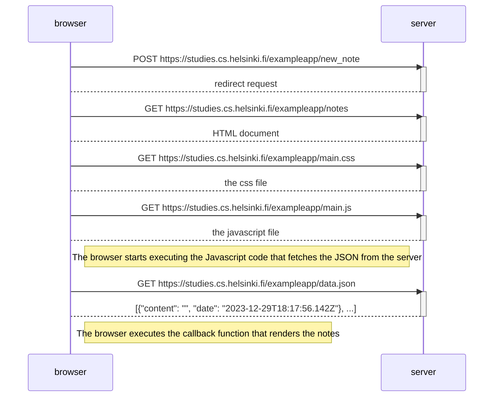

Sequence Diagram for when a user submits a new note on the page

```mermaid
sequenceDiagram
participant browser
participant server

browser->>server: POST https://studies.cs.helsinki.fi/exampleapp/new_note
activate server
server-->browser: redirect request
deactivate server

browser->>server: GET https://studies.cs.helsinki.fi/exampleapp/notes
activate server
server-->browser: HTML document
deactivate server

browser->>server: GET https://studies.cs.helsinki.fi/exampleapp/main.css
activate server
server-->browser: the css file
deactivate server

browser->>server: GET https://studies.cs.helsinki.fi/exampleapp/main.js
activate server
server-->browser: the javascript file
deactivate server

Note right of browser: The browser starts executing the Javascript code that fetches the JSON from the server

browser->>server: GET https://studies.cs.helsinki.fi/exampleapp/data.json
activate server
server-->browser: [{"content": "", "date": "2023-12-29T18:17:56.142Z"}, ...]
deactivate server

Note right of browser: The browser executes the callback function that renders the notes
```

