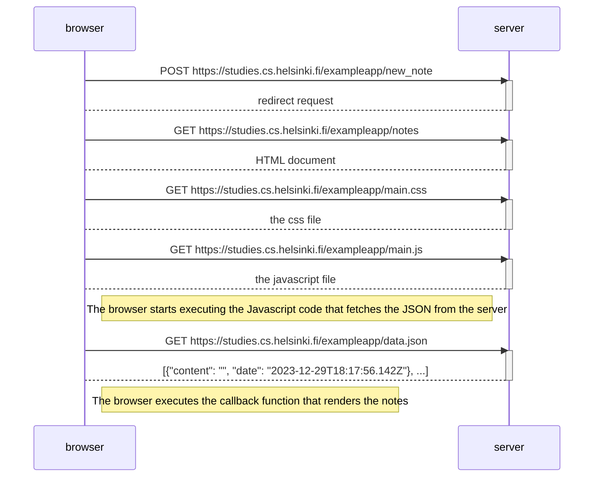
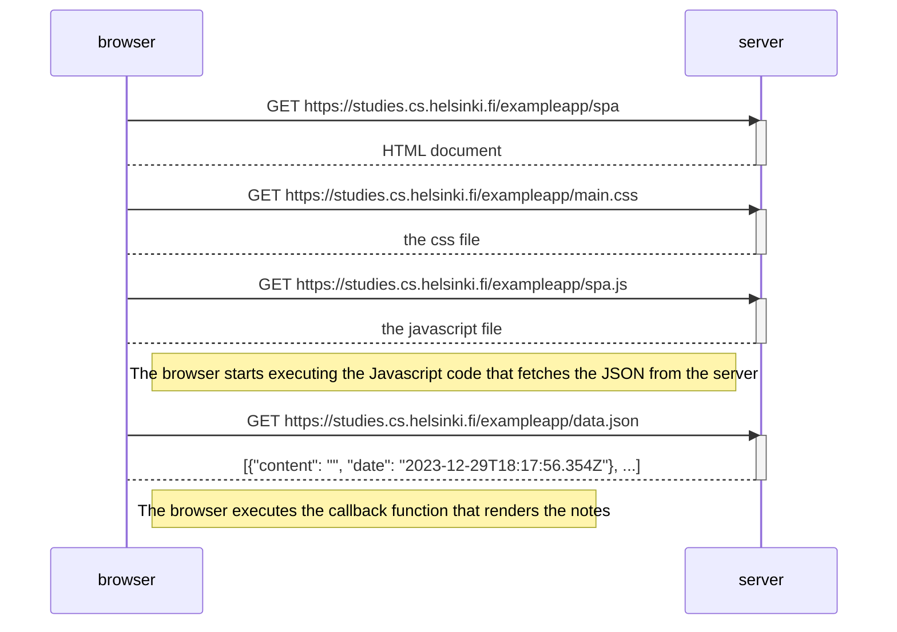
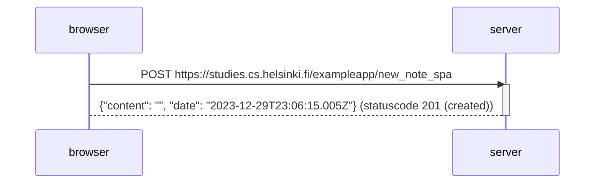

Exercise 0.4 Sequence Diagram for when a user submits a new note on the page

Exercise 0.5 Sequence diagram for when a user goes to the example app page in a browser (spa-version)

Exercise 0.6 Sequence diagram for when a user submits a new note on the page (spa-version)

Clarifying the last exercise: the javascript file in the browser registers an event handler to handle a situation where the form is submitted. This code prevents refreshing the page and instead creates a new note as a JSON string which is sent to the server. That is why the browser only sends one request to the server (POST-request to submitting a new note without refreshing the page).  
